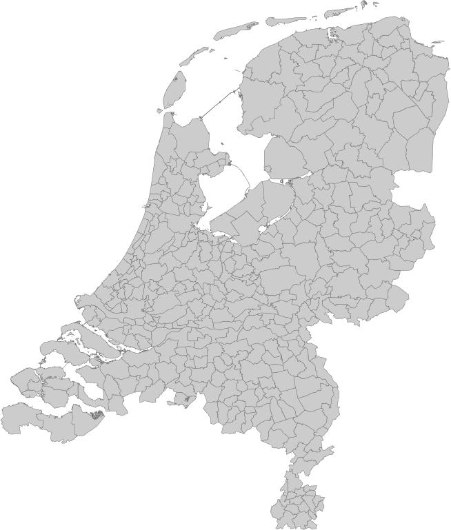

# Map of Dutch municipalities

Map of Dutch continental municipalities as of January 1st. 2021. This repo contains an .png image of the map, a svg file of border shapes and a json file containing CBS (GM) codes and municipality names.

Based on the data as published by the CBS.

# Conditions of use (in Dutch): 

Publicatie van digitale geometrie is toegestaan mits het CBS en het Kadaster als bronnen worden vermeld.
